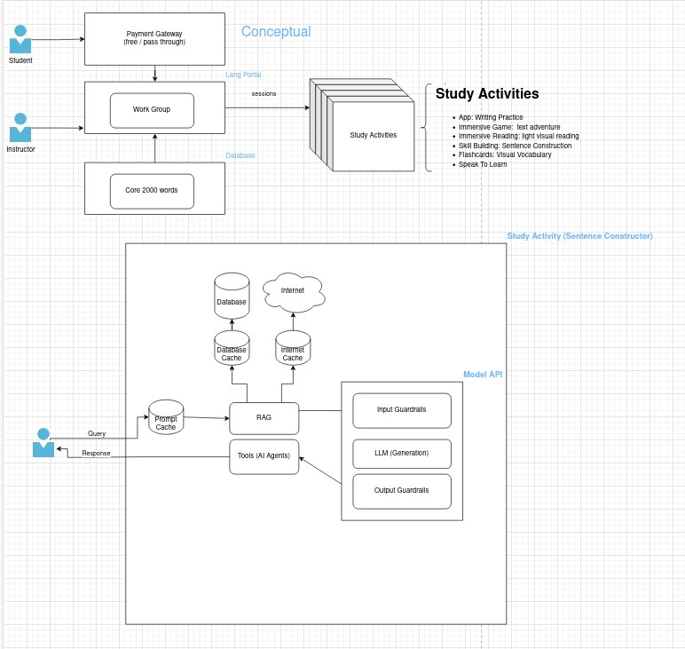

# GenAI New Language Acquisition 
**Purpose**: Business-facing guideance for creating the described solution.

# High-level Business Summary (conceptual)

## Objectives
1. Student: to add 2000+ core language words for a student in an new, unfamilar language include alphabet, phonics, words and syntax
2. Instructor: provide monitoring access to student progress and ability to provide feedback
3. Technology: utilize standard technology where ever possible

## Functional Requirements
1. single, on-prem solution per installation sight or region
2. content will be centered around common words and non-idiomatic or symbolic expressions.  Audio, video, imags and text will be used.

## Assumptions
1. use online solution to present coursework and provide productive feedback 

## Requirements
1. Students must be able to read, write and speak the core 2000 words
2. Instructors must be fluent in the target language in advance of mentoring student
3. Student and Instructor data must be kept as private data, protected from external observation, influence or modification

## Constraints
1. Solution should be resilent to internet outages
2. Solution should be avoid issue redundant work to support courses
3. All Data should be treated as PII data during the course work until completed. Then only the certificate is issued and the data remains private.

## Scope
1. single student course work
2. instructors may mentor 1 or more students concurrently

### Not In Scope
1. fictional languages unless there is support from a knowledgble instructor

## Risks
1. Power outages
   * Mitigration: "write to disk immediately" persistance goals
2. 

# Mid-Level Business and Technology Summary (logical)
- TBD

# Technical Summary (technical)
- TBD